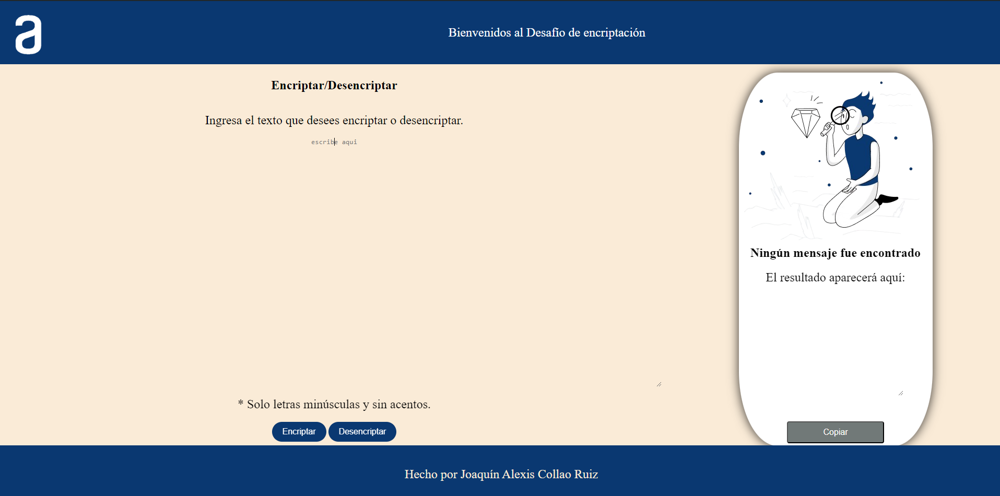
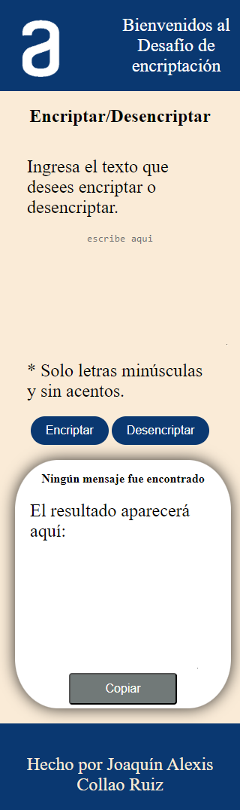
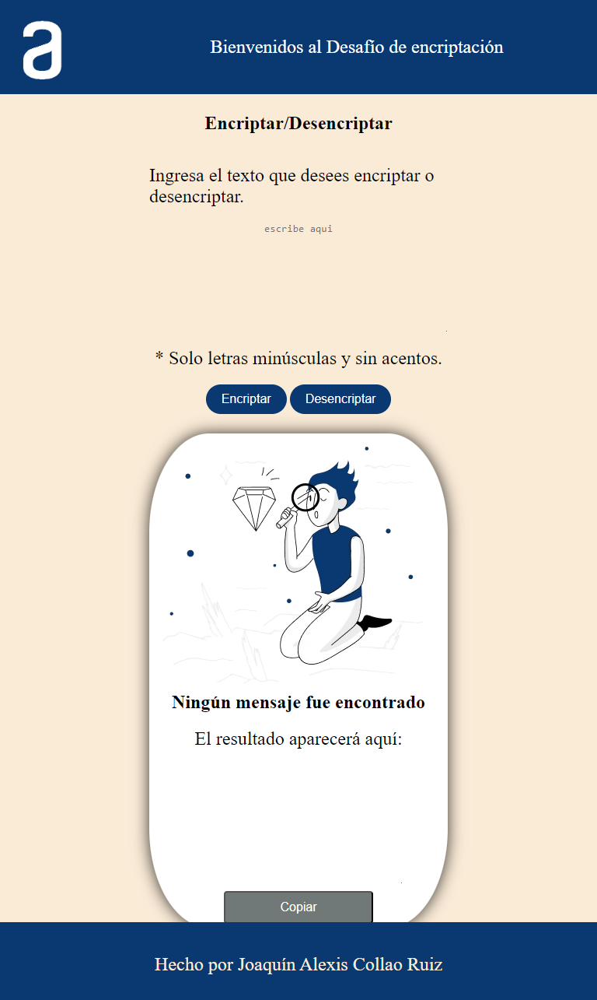

# desafió Alura Latam

## descripción

proyecto realizado con html,css y javascript

### objetivo

practicar las habilidades con html ,css y javascript

### funcionalidades

1. encriptar mensajes
2. desencriptar mensajes
3. copiar mensajes encriptados o desencriptados
4. versiones Movil,tablet y escritorio

### screenshots

#### version escritorio

- 
- 
- 
